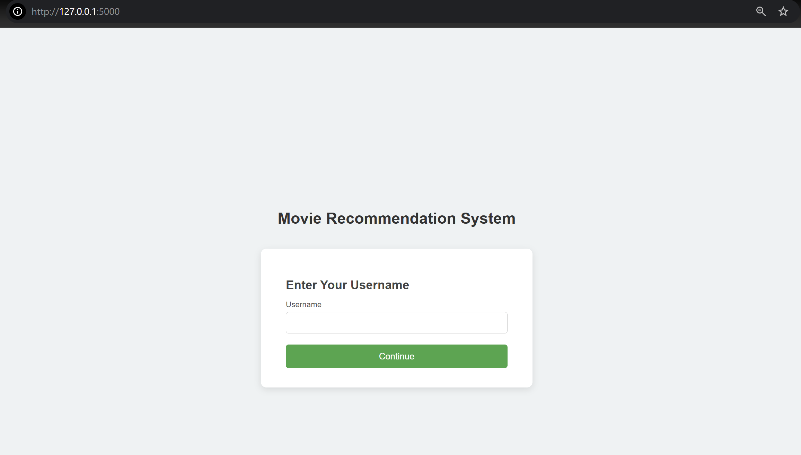
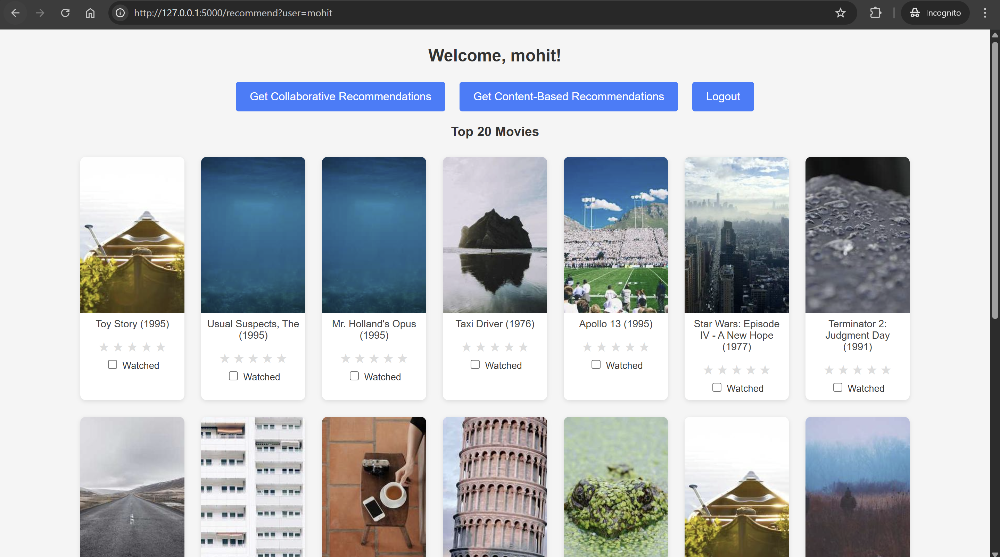

#  Movie Recommendation System

A prototype web application that offers personalized movie recommendations using **Flask**, **MongoDB**, and two complementary recommendation techniques:

1. **Collaborative Filtering**  
   Predicts what rating a user would give to movies they haven’t rated yet (based on their past ratings and other users’ behavior), then presents the top‑predicted movies.

2. **Content‑Based Filtering**  
   Finds movies similar to those the user has already watched, using TF‑IDF features and cosine similarity.

---

##  Features

-  **Username‑only access** — no passwords; 10 test users are preloaded in MongoDB.
-  **Movie dashboard**  
  - Top‑20 globally highest‑rated movies  
  - Interactive selection/search via datalist  
  - Movie poster thumbnails via placeholder API
-  **Rate movies** and record watch history.
-  **Dual recommendation modes**  
  - **Collaborative Filtering:** predicts unseen‑movie ratings and shows the top‑10 predicted favorites  
  - **Content‑Based Filtering:** suggests top‑10 similar titles based on TF‑IDF and cosine similarity
-  **User activity logging** (login, rating, recommendation requests, logout) with timestamps.
-  **MongoDB**  
  - `users` collection for user profiles & history  
  - `user_logs` collection for action logs

---

##  Project Structure

```

movie-recommender/
│
├── app.py
|
├── test.py
|
|── requirements.txt
├── requirements-linux.txt
|
├── a-b testing.ipynb
|
├── C_filtering.ipynb
├── CB_filtering.ipynb
│
├── runtime.txt
|
├── final_report.md
│
│
├── mongo_export/
│   ├── users.json                # Preloaded user profiles
│   └── log_sample.json           # Sample user action logs
|
└── templates/
    ├── index.html                # Username entry
    └── recommend.html            # Movie dashboard & recommendations

````

---

##  Setup Development Environment

### 1. Clone the repository
```bash
git clone https://github.com/mohitkumhar/movie-recommendation.git
cd movie-recommendation
```

### 2. Install Python dependencies

```bash
pip install -r requirements.txt
```

### 3. Start MongoDB

Run Docker container of mongoDB
```
# mongoDB Container on port 27017
docker run --name movieDB -v D:\movieDB:/data/db -p 27017:27017 -d mongo:latest 

# import the users.json into mongodb users collection
docker exec -i movieDB sh -c "mongoimport -c users -d user_db --jsonArray" < mongo_export\users.json

# import the log_sample.json into mongodb users_log collection
docker exec -i movieDB sh -c "mongoimport -c user_logs -d user_db --jsonArray" < mongo_export\log_sample.json

```
Make sure to import preloaded MongoDB data and Ensure that MongoDB is running locally on `mongodb://localhost:27017/`

### 4. Download Dataset

Make Sure to ***Download dataset***, 
It is necessary to generate all `.pkl` files.

Download from-

MovieLens Dataset: https://www.kaggle.com/datasets/grouplens/movielens-20m-dataset

***OR***

Run in **Powershell**
```bash
curl -o movielens-20m-dataset.zip https://www.kaggle.com/api/v1/datasets/download/grouplens/movielens-20m-dataset

Expand-Archive .\movielens-20m-dataset.zip .\
```
This dataset should be extracted in **`dataset/`** folder on the root dir

### 5. Generate all important pickle files and models

Before running the Flask app, you **must have all `.pkl`** files.

Run both `.ipynb` files:

```bash
C_filtering.ipynb       # for Collaborative filtering
CB_filtering.ipynb      # for Content-Based filtering
```

Make sure all `dataset/*.csv` exists - it is required for **Jupyter Notebook** (`.ipynb`) to create `.pkl` files.

**Note:** <i>To run in Jupyter Notebook, you should install jupyter notebook by `pip install jupyter` or can also be run in `VS Code`</i>

### 6. Run the app

```bash
python app.py
```
Open your browser at [http://localhost:5000](http://localhost:5000).

---



---
## How It Works

### Collaborative Filtering

1. Load user–movie rating matrix (`C_rating.pkl`) and pre‑trained Surprise model (`C_filtering_model.pkl`).
2. For the current user, identify movies they haven’t rated.
3. Predict a rating for each unseen movie.
4. Sort predictions descending and return the top‑N movie titles.

### Content‑Based Filtering

1. Load TF‑IDF vectorizer (`CB_tfidfVectorizer.pkl`) and cosine similarity matrix (`CB_cosine_sim_matrix.pkl`).
2. Compute an average similarity vector over the user’s watched‑movie indices.
3. Rank all movies by similarity (excluding already watched) and return top‑N titles.

---

## Sample Data Files

* **`mongo_export/users.json`**

  ```json
  [
    { "userId": 1, "username": "mohit", "moviesHistory": [] },
    { "userId": 2, "username": "alice", "moviesHistory": [] },
    …
  ]
  ```

* **`mongo_export/log_sample.json`**

  ```json
  {
    "user": { "userId": 1, "username": "mohit" },
    "action": "request recommendation",
    "details": { "type": "Collaborative Filtering" },
    "timestamp": "2025-07-01T14:22:31.123Z"
  }
  ```

---

## Future Work

* **Secure Authentication:** add password hashing & signup workflow
* **User Profiles & Preferences:** genres, watchlists, favorites
* **UI Enhancements:** responsive design, movie trailers via TMDB API
* **Analytics Dashboard:** visualize user engagement & model performance
* **Cloud Deployment:** MongoDB Atlas, Docker
* **Social Features:** allow users to follow friends and share recommendations

---

## Author

**Mohit Kumhar**

* GitHub: [@mohitkumhar](https://github.com/mohitkumhar)
* LinkedIn: [@mohitkumhar](https://linkedin.com/in/mohitkumhar)
* Email: [mohitmolela@gmail.com](mailto:mohitmolela@gmail.com)
